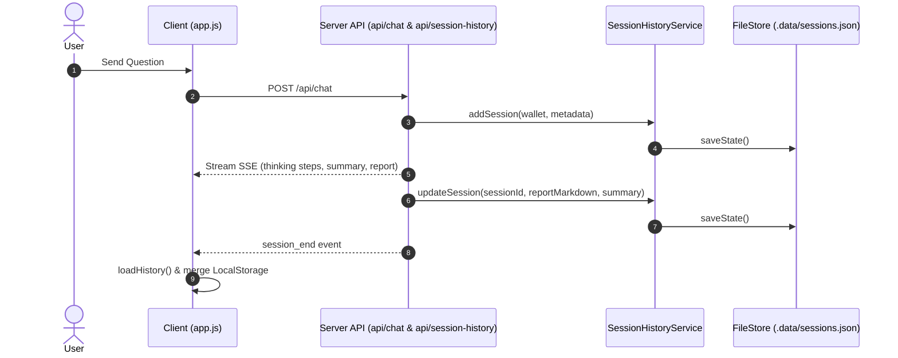

# Session History Persistence & Account Data System Design Spec

## 1. Executive Summary

This spec addresses critical persistence and data flow issues in the 两仪命理 (Bazi Culture MVP) platform:
1. Session history vanishing after creation or server restart.
2. In-memory reset of account balances, registration quotas, and user profiles.
3. Decoupling of dynamic 20-Agent report output from backend session history records.

---

## 2. Core Architecture Changes

### A. Server Data Storage Layer (`lib/storage/file-store.js`)
- A file-backed JSON persistence layer targeting local `.data/` directory:
  - `.data/accounts.json`
  - `.data/profiles.json`
  - `.data/sessions.json`
- Synchronizes with in-memory `Map` instances in `AuthService`, `ProfileService`, and `SessionHistoryService`.
- Automatic read on startup and atomic write/flushing on create/update/delete actions.

### B. Session History Lifecycle & SSE Callback (`api/chat.js` & `SessionHistoryService`)
- When `/api/chat` completes execution of `run6StagePipeline`, update the corresponding `sessionId` record in `SessionHistoryService` with:
  - `summary`: The final 200-word conversational conclusion.
  - `reportMarkdown`: The full 1500-word dynamic Markdown report.
- Support full CRUD operations on session history via `/api/session-history`:
  - `GET /api/session-history?wallet=...` -> fetch user sessions.
  - `POST /api/session-history` (action: `add` / `update` / `bookmark`) -> create or update session state.
  - `DELETE /api/session-history` -> delete specific session.

### C. Client Storage Resilience & Session Switcher (`app.js`)
- Frontend `loadHistory()` logic:
  - Combines LocalStorage `bazi_sessions_${wallet}` with remote API data.
  - Does NOT overwrite LocalStorage if API returns empty array due to transient errors or server cold-start.
- "New Chat" (`#new-chat-btn`):
  - Resets current active conversation ID (`currentSessionId = null`).
  - Clears UI message list and resets waiting state cleanly.
- "Session Item Click":
  - Loads selected session's prompt, agent steps/conclusion, and 1500-word markdown report.
  - Allows bookmarking/starring and deleting sessions directly from the sidebar.

---

## 3. Data Flow Diagram

---

## 4. Verification Plan

1. **Automated Tests**:
   - `npm test`: Verify all unit tests (Auth, Chat, Profile, History, Bazi Engine) pass 100%.
   - `node --env-file=.env scripts/test-simulation.mjs`: Verify 6-Stage simulation succeeds and session history retains generated report.

2. **End-to-End Persistence Validation**:
   - Create a session, restart dev server (`npm run dev:web`), verify history and account credits remain intact.
   - Click "新建对话", verify old history session remains clickable in left sidebar with complete 1500-word report.
