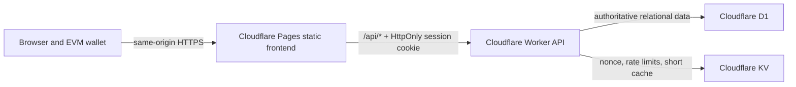

# Cloudflare Wallet Account System Design

## Goal

Replace the process-local account system with a production Cloudflare deployment where an EVM wallet is the sole account credential. A user who loses wallet control cannot recover the account or its data. After a verified wallet login, the user can access only that wallet's persisted profiles, reports, conversations, credits, bookmarks, and synchronized preferences from any device.

## Current Gaps

The current `AuthService`, `ProfileService`, and `SessionHistoryService` retain authoritative data in in-memory maps. Server restarts, Cloudflare isolate eviction, and horizontal scaling therefore lose or split user data. API routes accept a caller-provided `wallet` value as the effective owner, allowing a client to request or modify another wallet's resources. The existing Redis-compatible session store is suitable for short-lived state, but it is not used as a persistent account database.

## Deployment Architecture

Cloudflare Pages hosts the static frontend. A standalone Worker owns all `/api/*` routes and binds the data stores. The Pages deployment routes API traffic to the Worker at the same public origin so the browser can use first-party secure cookies without CORS configuration or client-visible bearer tokens.

Environment separation is required:

- `development`: local D1 database and local Worker configuration.
- `preview`: isolated D1 and KV bindings for pull-request or preview deployments.
- `production`: production D1, KV namespace, Worker route, Pages deployment, and Cloudflare Secrets.

No secret is committed to the repository. AI-provider configuration, webhook secrets, encryption salts, and any deployment credentials remain Cloudflare Secrets or local `.dev.vars` values excluded from Git.

## Identity and Authentication

The lower-cased, checksum-validated EVM wallet address is the immutable user identity. A username may be a display field, but it is not an authentication factor and cannot be used to recover an account.

1. The browser asks the Worker for a one-time challenge after selecting a wallet.
2. The Worker records a random nonce in KV with a ten-minute TTL. The message includes wallet, requested operation, canonical production origin, issued time, nonce, and version.
3. The wallet signs the exact message using `personal_sign`.
4. The Worker recovers the signer with `verifyMessage`, checks every challenge binding, atomically consumes the nonce, then creates the user if this is the first verified login.
5. The Worker generates a high-entropy session secret, stores only its hash with wallet ID, expiry, creation metadata, and revocation state in D1, and sets the raw secret as a `Secure`, `HttpOnly`, `SameSite=Lax`, path-scoped cookie.
6. Every protected endpoint obtains the wallet identity exclusively from the validated cookie session. Request-body or query-string wallet values are ignored for authorization.
7. Logout revokes the server session and clears the cookie. Expired, revoked, missing, rejected-signature, and changed-wallet states produce an unauthenticated response; the frontend clears account data from memory and does not display another wallet's cached data.

All authentication and write endpoints are rate-limited by IP and wallet through KV. Challenge records are one-use. The Worker records security-relevant authentication successes and failures without storing private keys, signatures longer than needed for verification, or raw cookie values.

## Authoritative Data Model

Cloudflare D1 is the sole source of truth for account data. Each user-owned table references `users.id`; API queries always add an owner constraint derived from the authenticated session.

| Table | Purpose | Key constraints |
| --- | --- | --- |
| `users` | Wallet identity, creation time, optional display name, account status | unique normalized wallet address |
| `profiles` | Persisted命主 profiles and active-state metadata | owned by one user; soft-deletable |
| `conversations` | Conversation title, question, topic, timestamps, bookmark state | owned by one user; indexed by recency |
| `conversation_messages` | Ordered question/assistant and pipeline message content | owned through its conversation |
| `reports` | Full dynamic report, summary, chart metadata, generation state | one current report per conversation |
| `user_preferences` | Current profile, workspace layout, and explicitly saved UI settings | one row per user |
| `credit_ledger` | Immutable grants, debits, adjustments, and idempotency keys | append-only; amount and balance are transactional |
| `auth_sessions` | Hashed session secret, expiry, revocation, device metadata | indexed by secret hash and user ID |
| `audit_events` | Authentication, privacy-sensitive writes, and operator-relevant events | append-only; bounded retention policy |

The initial account grant and each AI deduction use a D1 transaction. A report is attached to its conversation only after generation succeeds; failures retain a visible failed generation state without creating a fabricated report. The chat service uses an idempotency key so reconnects or client retries cannot double-charge credits or duplicate records.

Soft deletion covers user-facing profiles and conversations, enabling operational recovery inside the defined retention window. The product does not offer wallet-loss recovery, support impersonation, email recovery, or alternative login factors. Account-wide erasure and retention windows will be exposed as an explicitly authenticated product workflow rather than a hidden operator action.

## API Boundary

New API contracts are session-oriented:

- `GET /api/auth/challenge`: obtain a nonce for a wallet and supported operation.
- `POST /api/auth/register` and `POST /api/auth/login`: verify signature, create or resume an account, then issue the cookie session.
- `GET /api/auth/me`: return only the authenticated account summary and preferences.
- `POST /api/auth/logout`: revoke the current session.
- `GET|POST|PATCH|DELETE /api/profiles`: operate only on the authenticated user's profiles.
- `GET|POST|PATCH|DELETE /api/conversations`: list and mutate only the authenticated user's conversations, messages, bookmarks, and reports.
- `GET|PATCH /api/preferences`: fetch and synchronize selected profile and UI settings for the authenticated user.
- `POST /api/chat`: derive user and profile ownership from the session, debit once transactionally, stream generation, and persist its final report under the created conversation.

Unauthorized requests return `401`; authenticated access to an absent or non-owned resource returns `404` to avoid resource enumeration. Input is schema-validated, JSON response error codes are stable, and no endpoint returns registered IP addresses or internal storage details to the browser.

## Frontend Behavior

The frontend no longer treats `localStorage` wallet state as proof of identity. It may retain non-sensitive rendering cache only after a successful `/api/auth/me`, keyed by the authenticated wallet, and must clear it on logout, `401`, chain/account changes, or a failed signature.

On startup the app requests the current session. A valid response loads the account, profiles, conversation index, selected profile, and UI preferences from the API. An absent session leaves the workbench in a logged-out state with no remote account information. Mutations update the server first and update local state only from the returned server record. The synced preferences include selected profile, layout preferences, and explicit workspace settings.

## Security Controls

- Require HTTPS in production; set session cookies to `Secure`, `HttpOnly`, and `SameSite=Lax`.
- Use canonical allowed origins for signing challenges and reject unexpected origins in production.
- Apply strict Content Security Policy, `X-Content-Type-Options`, `Referrer-Policy`, and clickjacking protections at Pages/Worker boundaries.
- Use parameterized D1 queries; validate JSON request schemas and size-limit reports and history payloads.
- Rate-limit challenge issuance, signature attempts, chat generation, and destructive actions.
- Make session revocation, nonce consumption, credit debits, and conversation creation idempotent or transactional as applicable.
- Keep encryption keys and upstream service credentials in Cloudflare Secrets; do not expose them in the frontend bundle, API payloads, logs, or documentation examples.

## Migration and Rollout

The current in-memory store cannot provide a dependable production dataset or user ownership proof, so it is not migrated automatically. Existing browser caches are not treated as authoritative. Production data begins after users sign in with their wallets on the deployed site.

The repository will gain D1 migrations, Worker and Pages configuration, local development bindings, preview/production environment documentation, and an explicit deployment checklist. Deployment creation requires a logged-in Cloudflare account with authority to create the Pages project, Worker, D1 database, KV namespace, routes, secrets, and any custom domain binding. Nothing will be deployed until those Cloudflare credentials and target domain/project details are available.

## Verification Gates

The implementation must prove, rather than assume, all of the following:

1. Valid registration and login issue a session; invalid, expired, replayed, wrong-wallet, and wrong-origin signatures fail.
2. A user cannot read, modify, delete, bookmark, or generate reports against another user's resource by supplying their wallet or a foreign resource ID.
3. Profiles, full reports, conversations, credits, bookmarks, and preferences persist through Worker restarts and reload across a second browser session.
4. Concurrent or retried chat requests do not double-debit credits or create duplicate conversations.
5. D1 migration tests and route tests pass against the Worker runtime; the project's `npm test` and `node --env-file=.env scripts/test-simulation.mjs` pass after logic changes.
6. A deployed preview undergoes real browser authentication, persistence, logout, and cross-device synchronization checks before production promotion.
7. Production health checks verify the Pages site, Worker API, D1 binding, KV binding, and no secret leakage in response headers, client bundles, or logs.
